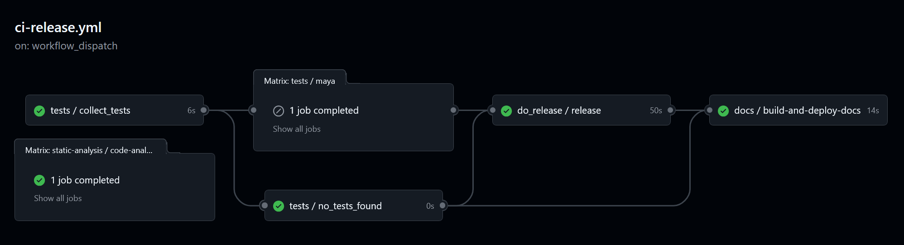

<a id="readme-top"></a>

<!-- PROJECT SHIELDS -->
<div align="center">

<!-- PROJECT LOGO -->
<br />
  <a href="https://github.com/{{PROJECT_OWNER}}/{{PROJECT_NAME}}">
    
  </a>

<h3 align="center">{{PROJECT_NAME}}</h3>

  <p align="center">
    Development and Contributing Guidelines
    
</div>


<!-- TABLE OF CONTENTS -->

<!-- TABLE OF CONTENTS -->
<details>
  <summary>Table of Contents</summary>
  <ol>
    <li><a href="#contributing">Contributing</a></li>
    <ul>
        <li><a href="#commit-messages">Commit Messages</a></li>
    </ul>
    <li><a href="#project-dependencies">Project Dependencies</a></li>
    <li><a href="#tests">Tests</a></li>
    <li><a href="#linting-and-type-hinting">Linting and Type Hinting</a></li>
    <li><a href="#documentation">Documentation</a></li>
    <li><a href="#continuous-integration">Continuous Integration</a></li>
    <ul>
      <li><a href="#further-useful-information-on-the-workflows">Further useful information on the workflows</a></li>
    </ul>
  </ol>
</details>

## Contributing
1. Fork the Project.
2. Create your Feature Branch (`git checkout -b feature_name`).
3. Commit your Changes (`git commit -a -m "feat: a wonderful new feature"`).
4. Push to the Branch (`git push origin feature_name`).
5. Open a Pull Request.

### Commit Messages:
This project (optionally) uses [Python Semantic Release](https://python-semantic-release.readthedocs.io/en/latest/). To use this feature, please follow the [commit message convention](https://github.com/angular/angular.js/blob/master/DEVELOPERS.md#commits) to ensure changes are correctly versioned in any future releases.
 
Cheat sheet:
 
- Patch release, backwards-compatible bug `fix` _in git commit message title_. 
  - `git commit -a -m "fix: a great fix"`
- Minor release, backwards-compatible `feat` _in git commit message title_.
  - `git commit -a -m "feat: a wonderful new feature"`
- Major release, incompatible API change `BREAKING CHANGE` _in git commit message footer (use `fix` or `feat` for message title)_.
  - `git commit -a -m "feat: total refactor" -m "BREAKING CHANGE: breaks api"`


<p align="right">(<a href="#readme-top">back to top</a>)</p>


## Project Dependencies
> <h4>Update to reflect the new project's specific requirements!<br><br>
> The below instructions assume a virtual environment created from mayapy is being used for the project,
> for more info see: https://help.autodesk.com/view/MAYACRE/ENU/?guid=GUID-6AF99E9C-1473-481E-A144-357577A53717.</h4> 

Project dependencies are available in the [requirements.in](requirements.in) file, which should be compiled with [pip-tools](https://github.com/jazzband/pip-tools). 

1. Install pip-tools: 
    ```sh
    pip install pip-tools
    ```
2. Dependencies can be added to:
    * [requirements.in](requirements.in): User requirements.
    * [requirements-dev.in](requirements-dev.in): Development requirements. 
    * [requirements-test.in](requirements-dev.in): Test requirements.
3. Compile the requirement files as needed (below combines all three files into one `requirements.txt`, however it's possible to have separate files for each):
    ```sh 
    pip-compile --output-file requirements.txt requirements.in requirements-dev.in requirements-test.in
    ``` 
4. Install dependencies:        
   * Windows: 
      * ```sh
        pip-sync --python-executable %VIRTUAL_ENV%/scripts/python.exe requirements.txt
        ```
   * Linux: 
      * ```sh
        pip-sync --python-executable $VIRTUAL_ENV/bin/python.exe requirements.txt
        ```
      </details>
    

<p align="right">(<a href="#readme-top">back to top</a>)</p> 

<!-- TESTS -->
## Tests

Tests are written with [Pytest](https://docs.pytest.org/) and should adhere to the ["Arrange, Act, Assert" pattern](https://docs.pytest.org/en/stable/explanation/anatomy.html).

To run tests locally:
-   ```sh
    pytest
    ```

with coverage:
-   ```sh
    pytest --cov=src/
    ```

<p align="right">(<a href="#readme-top">back to top</a>)</p>


## Linting and Type Hinting
Static code analysis is performed with [Pylint](https://pypi.org/project/pylint/), formatting with [Black format](https://github.com/psf/black), and type hinting with [mypy](https://mypy.readthedocs.io/en/stable/).

To run pylint locally:

-   ```sh
    pylint --rcfile=.pylintrc src/
    ```
    - A modified [.pylintrc](.pylintrc) file is provided with modifications to ignore Maya import errors. Append to this file as needed.  

Black formater can be run locally with:

-   ```sh
    black src/
    ```

Run [mypy](https://mypy.readthedocs.io/en/stable/) checks locally with:

-   ```sh
    mypy src/
    ```
    - A modified [mypy.ini](mypy.ini) file is included with modifications to ignore Maya import errors. Append to this file as needed.

<p align="right">(<a href="#readme-top">back to top</a>)</p>


## Documentation
Documentation is built with [mkdocs](https://www.mkdocs.org/). To build the docs locally:
-   ```sh
    mkdocs build
    ```
To serve the docs locally:
-   ```sh
    mkdocs serve
    ```

<p align="right">(<a href="#readme-top">back to top</a>)</p>


<!-- CI -->
## Continuous Integration
Continuous integration is set up with [GitHub Actions][github-actions-url], workflows can be found in the [.github/workflows](.github/workflows) directory. There are 2 main workflows:
1. [ci-main.yml](.github/workflows/ci-main.yml): This workflow is intended to be a fast check to ensure the code is in a good state, and code standards are met. It runs automatically on every push and pull request to main or can be triggered from the `Run workflow` button on the [actions menu](https://github.com/{{PROJECT_OWNER}}/{{PROJECT_NAME}}/actions/workflows/ci-main.yml). It runs tests (if they exist), and performs linting, formatting, and type hinting checks.
   <div align="center">        
    </div>
2. [ci-release.yml](.github/workflows/ci-release.yml): This workflow will do all the above, create a release version of the repo and deploy the documentation to GitHub pages. It can be run from the `Run workflow` button on the [actions menu](https://github.com/{{PROJECT_OWNER}}/{{PROJECT_NAME}}/actions/workflows/ci-release.yml).
   <div align="center">        
     </div>

### Further useful information on the workflows:
* Versions of Maya to test against can be specified in the [reusable-maya-tests.yml](.github/workflows/reusable-maya-tests.yml) file.
  * The Maya tests workflow will only run if tests exist in the `tests` directory, otherwise the CI will skip this workflow to avoid pulling the Maya Docker image unnecessarily.
* [Coding standards enforced](.github/workflows/reusable-static-analysis.yml) with [pylint](https://pypi.org/project/pylint/), [black](https://github.com/psf/black), and [mypy](https://mypy.readthedocs.io/en/stable/), with minimal configuration.
* [Docs are built](.github/workflows/reusable-build-and-deploy-docs.yml) with [mkdocs](https://www.mkdocs.org/) and deployed to GitHub pages: [https://{{PROJECT_OWNER}}.github.io/{{PROJECT_NAME}}](https://{{PROJECT_OWNER}}.github.io/{{PROJECT_NAME}}).
  *  > To enable GitHub pages, go to the settings of your repository, scroll down to the GitHub Pages section, and select the `gh-pages` branch as the source.
  *


<p align="right">(<a href="#readme-top">back to top</a>)</p>


[github-actions-url]: https://github.com/features/actions
